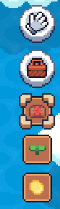
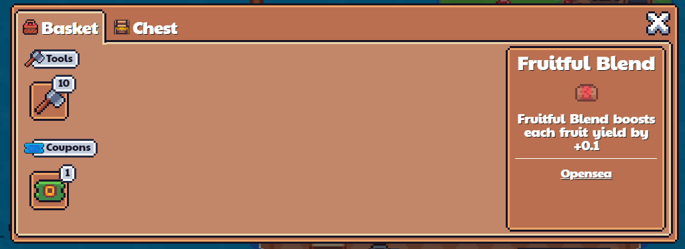
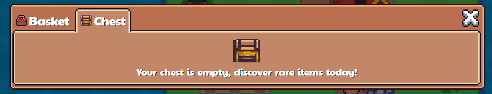
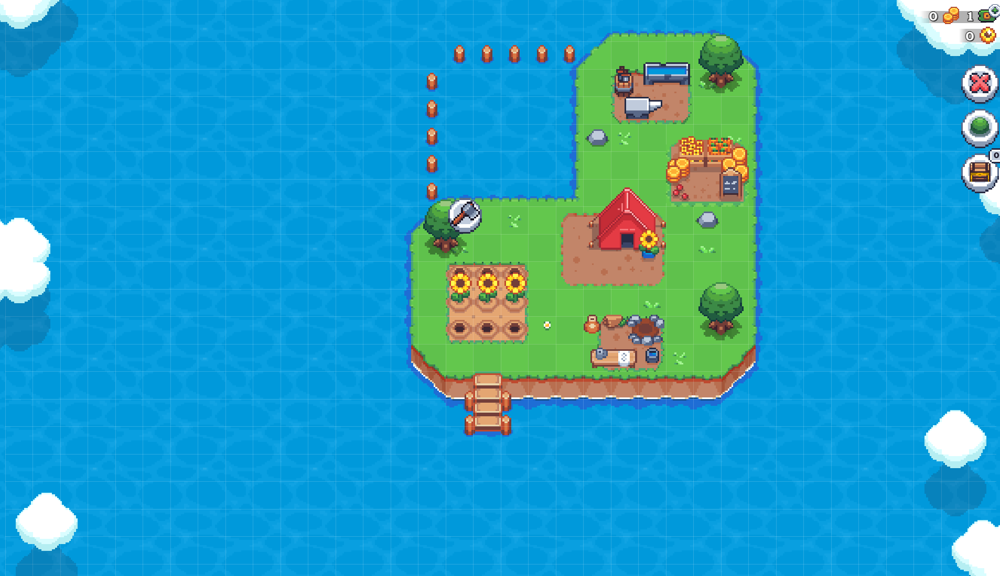
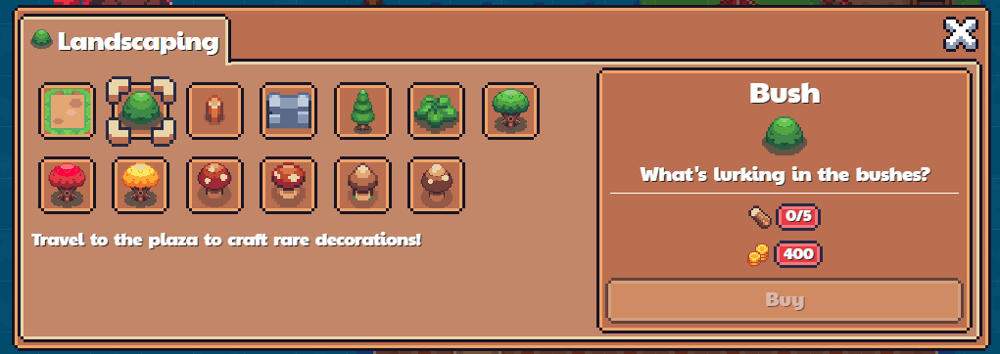

# Basket and Landscaping
Below your Game balances there's the Landscaping and Basket Icons

## Basket
The Basket contains your items that you use to interact with the game. They include:
- Seeds
- Fertilisers
- Crops
- Fruits
- Flowers
- Exotic Crops
- Tools
- Resources
- Bait
- Fish
- Foods
- Beach Bounty
- Coupons

## Chest
Your Chest contains collectibles that you can place down on your land to display on your land

## Landscaping
Clicking on the glove icon will put your island to landscaping mode, where you can edit the design on your island. 

Clicking on the bush icon allows you to buy additional decorations to place on your land
