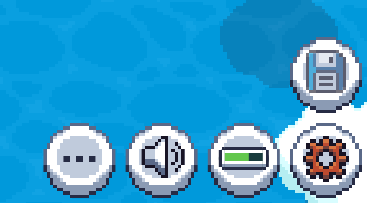
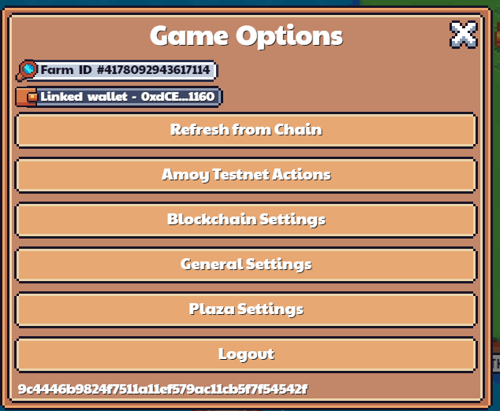

# Settings Menu

At the bottom right, there's the Save icon and the Gear (settings) icon. Clicking on the Gear icon extends the menu and bring up 3 additional icons (from right to left):

- Show/Hide status bars
- Sound
- Game Options

Clicking on the 3 dots brings up the Game Options Menu, where you can execute additional options for the game

