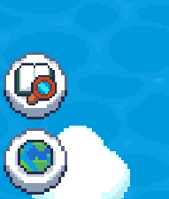
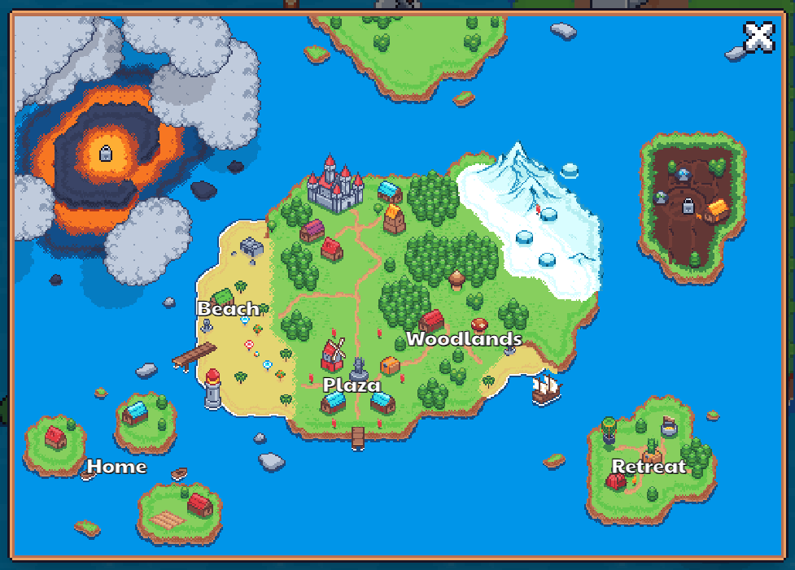
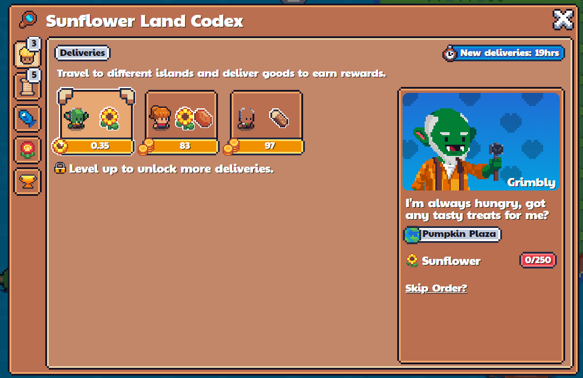
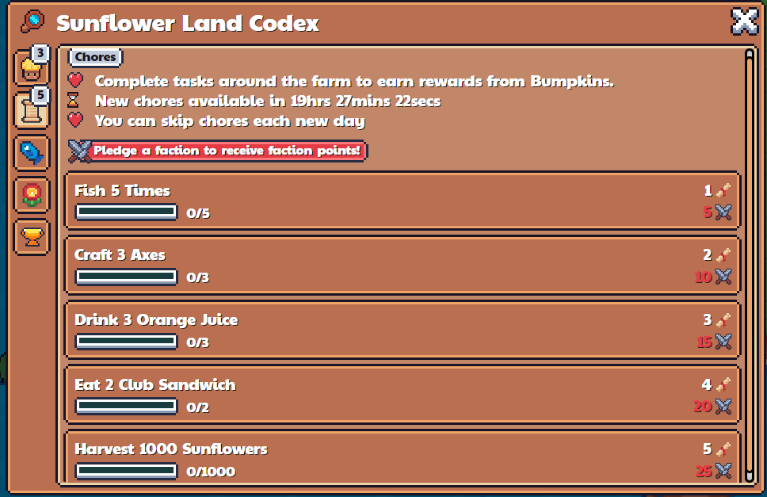
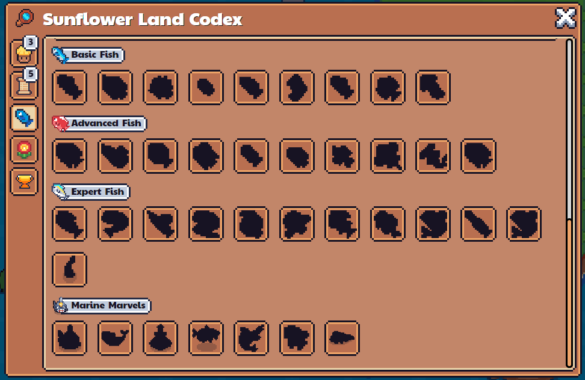
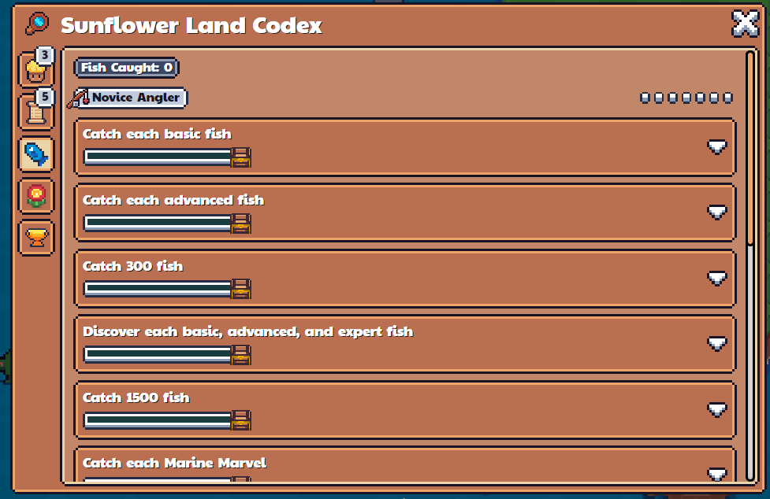
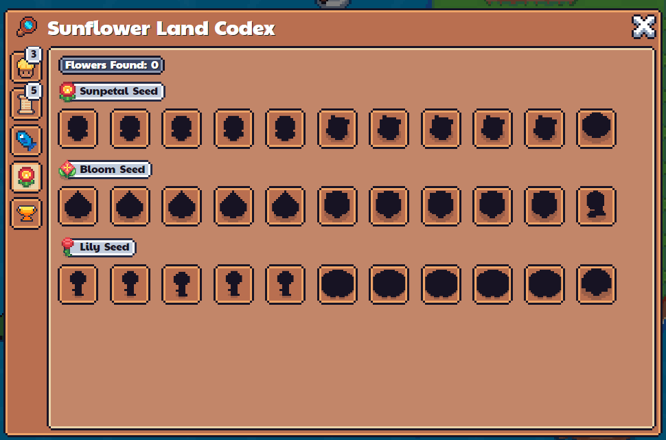
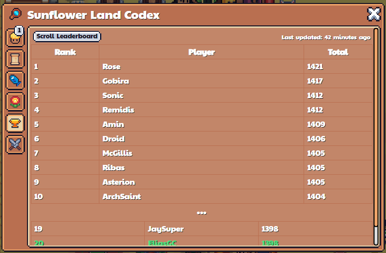
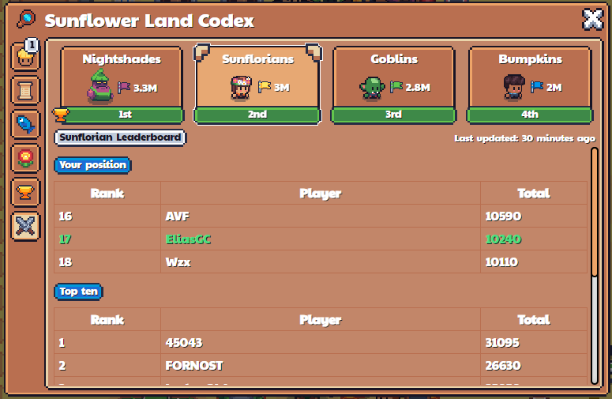

# World and Codex Buttons

## World Map
At the bottom left we have the World and Codex Buttons

The World button brings up a map of the various areas of the game.

## Codex
The Codex contains 5 tabs: Deliveries, Chores, Fish Codex, Flower Codex and Seasonal Ticket Leaderboard.

### Deliveries
The Deliveries tab contains the deliveries that you can fulfill in the Plaza

### Chores
The Chores tab contains the tasks that you can complete to earn the seasonal ticket

### Fish Codex
The Fish Codex is a list of fish that you can catch in the game

There are also quests that you can complete along the way

### Flower Codex
The Flower Codex is a list of flowers that you can grow

### Seasonal Ticket Leaderboard
The leaderboard shows the current standing between players for the amount of seasonal tickets players currently holds. This is useful to find out where you stand so that you can decide what auctions to bid for.

### Faction Leaderboard
A 6th tab will appear when you join a faction, which shows an inter-faction leaderboard (between factions) and an intra-faction leaderboard (within faction)
